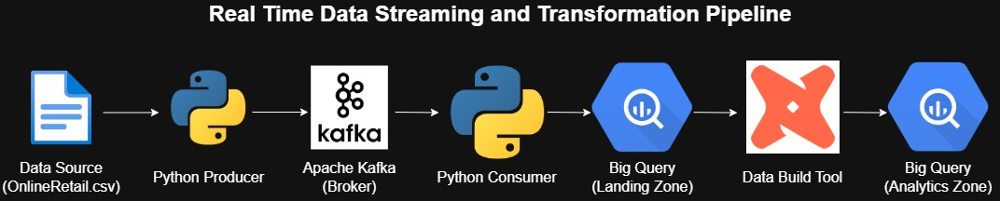

# End-to-End Real-Time E-commerce Data Pipeline

[](https://www.python.org/)
[](https://kafka.apache.org/)
[](https://cloud.google.com/bigquery)
[](https://www.getdbt.com/)
[](https://www.docker.com/)

## 📝 Project Overview

This project demonstrates the construction of an **end-to-end streaming data pipeline** that simulates and processes user events from an e-commerce platform in *real-time*. Raw data from the source is streamed using **Apache Kafka**, stored in **Google BigQuery**, and transformed into a clean, analytics-ready data model using **dbt (Data Build Tool)**.

This project is designed to showcase a fundamental understanding of modern data architecture, real-time data ingestion, and efficient data modeling principles.

---

## ✨ Key Features

* **Real-Time Data Ingestion**: Utilizes Kafka to handle a continuous stream of data, mimicking a production environment where events occur every second.
* **Scalable Architecture**: Leverages Google BigQuery as a serverless, highly scalable data warehouse capable of handling data volumes from small to massive.
* **Modern Data Transformation**: Implements data transformation best practices with dbt, separating raw data from analytics-ready data and building tested, documented models.
* **Reproducible Environment**: Uses Docker to run Kafka, ensuring a consistent and easy-to-set-up development environment.

---

## 🏗️ Pipeline Architecture

The pipeline consists of several key components that work sequentially to process the data:



1.  **Python Producer**: A script that reads data from a CSV file and streams each row as a JSON message to a Kafka topic.
2.  **Apache Kafka**: Acts as a reliable message broker, receiving the data stream from the producer and making it available to the consumer.
3.  **Python Consumer**: A script that subscribes to the Kafka topic, consumes messages in real-time, and loads them into a raw table in BigQuery.
4.  **Google BigQuery**: Serves as the Data Warehouse with two layers:
    * **`ecommerce_raw` Dataset**: A landing zone for raw data directly from Kafka.
    * **`ecommerce_analytics` Dataset**: An analytics zone containing clean views and tables transformed by dbt.
5.  **dbt (Data Build Tool)**: Fetches data from the raw zone, then cleans, transforms, and aggregates it into data models ready for business analysis.

---

## 🛠️ Setup & Installation

To run this project in a local environment, follow these steps:

### **Prerequisites**
* [Git](https://git-scm.com/)
* [Docker & Docker Compose](https://www.docker.com/products/docker-desktop/)
* [Python 3.8+](https://www.python.org/downloads/)
* A Google Cloud Platform (GCP) account with the BigQuery API enabled.

### **Installation Steps**

1.  **Clone the Repository**
    ```bash
    git clone [https://github.com/YOUR_USERNAME/YOUR_REPO_NAME.git](https://github.com/YOUR_USERNAME/YOUR_REPO_NAME.git)
    cd YOUR_REPO_NAME
    ```

2.  **Configure Google Cloud**
    * Create a **Service Account** in GCP with the `BigQuery Data Editor` and `BigQuery Job User` roles.
    * Download the Service Account key as a **JSON** file.
    * **IMPORTANT**: Save this JSON file in the project's root directory, but **NEVER** commit it to Git. The `.gitignore` file is already configured to ignore it.
    * Either rename your JSON file to match the path in the scripts or update the path inside `kafka_consumer/consumer.py` and `~/.dbt/profiles.yml`.

3.  **Set Up Python Environment**
    * (Optional but recommended) Create and activate a virtual environment:
        ```bash
        python -m venv venv
        source venv/bin/activate  # or `venv\Scripts\activate` on Windows
        ```
    * Install all required dependencies:
        ```bash
        pip install -r requirements.txt
        ```

4.  **Set Up dbt**
    * Initialize your dbt profile. dbt will ask for the location of your JSON key file.
        ```bash
        dbt init
        ```
    * Ensure your `~/.dbt/profiles.yml` file is correctly configured to point to your GCP project and the `ecommerce_analytics` dataset.

---

## 🚀 How to Run the Pipeline

Execute the following commands from the project's root directory, using a **separate terminal** for each step.

1.  **Start Kafka (in Terminal 1)**
    Wait for about 30-60 seconds to allow Kafka to fully initialize.
    ```bash
    docker-compose up -d
    ```

2.  **Run the Consumer (in Terminal 2)**
    The consumer must be running first to be ready to receive messages.
    ```bash
    python kafka_consumer/consumer.py
    ```

3.  **Run the Producer (in Terminal 3)**
    Once the consumer is ready, run the producer to start sending data.
    ```bash
    python kafka_producer/producer.py
    ```

4.  **Run the dbt Transformations (in Terminal 1 or 4)**
    After the data has been loaded into BigQuery, run dbt to perform the transformations.
    ```bash
    cd dbt_ecommerce
    dbt run
    ```

---

## ❤️ Closing Note
Made with ☕ for data engineering.
